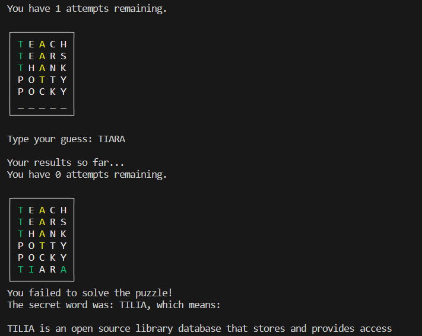

# Wordle Game

Welcome to the Wordle game! Test your vocabulary and deduction skills as you attempt to guess the secret word within a limited number of tries. Each attempt provides you with feedback, making the game an interactive and iterative experience.


_Example of the Wordle game in action._

  
  
  


## Features
- **Custom Word Database**: Uses the biggest list of words to ensure each game feels fresh and challenging.(I have included a script to filter the word so you can add your own word list)  
- **Intuitive Feedback**: Get color-coded feedback on each of your guesses:
  - Green: Letter is correct and in the right position.
  - Yellow: Letter is correct but in the wrong position.
  - White: Letter is incorrect.
- **Integration with OpenAI**: Receive a simple definition for the secret word once you've guessed it or once the game ends.
- **Limit on Attempts**: Adds a challenging element by limiting the number of guesses you can make.

## Usage

1. **Setup**:
    - Install the required libraries: `colorama` and `openai`.
    - Set your OpenAI API key in the environment variable `OPENAI_API_KEY`.

2. **Start the Game**:
    ```python
    python play_wordle.py
    ```

3. **Guessing**:
    - Type in your guess and press Enter.
    - Ensure your word is 5 letters long and is a valid word from the database.
    - Use the color feedback to make informed guesses in subsequent rounds.

4. **End of Game**:
    - Once you've guessed the word or run out of attempts, the game will reveal the secret word and its simple definition.

## Contributing

Feel free to fork this project and add your own enhancements or fixes. Pull requests are welcome!

---

Enjoy the game and keep challenging yourself!

## 👩‍💻 Author
**Sheng Yun**
- Github: [@nickShengY<nickShengY>](https://github.com/nickShengY)
- Email: <syun13@fordham.edu>/<s24yun@uwaterloo.ca>


